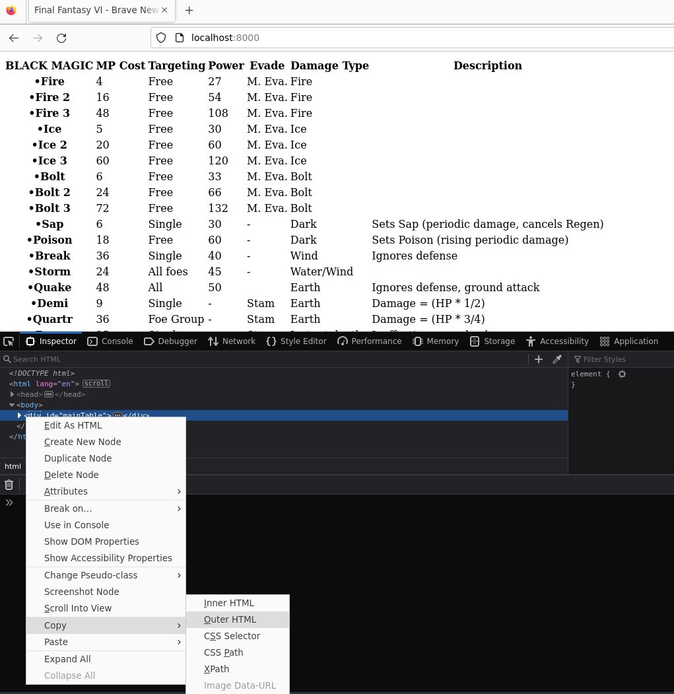

# bnwsite generator

This is the static page generator for [bnw.pages.dev](https://bnw.pages.dev).

I'm going to go over every directory in the repo and walk you through adding an example table to the site.

This is going to be a lot to take in with a lot of room for user error. Possibly we can work on reducing the number of manual steps in this process.

## `csv2json/`

This directory contains:

- `csv2json/data_structures.py` - a module, where data structures are defined.
- `csv2json/csv_to_json.py` - a python executable. Will take every csv file and generate json files inside of `generator/json/`
- any number of csv files.

### Adding a new table via csv2json

If you didn't know, csv means "comma separated values".

you want to add a new table, create a csv file and keep it with the rest of them in this directory.

The first line should be the heading.
The first entry of every heading line should be "name"
Each line should have the same number of entries separated by commas.
You should avoud using a comma inside of an entry, as the program that reads the csv will be confused by this. I use a semicolon in place of a comma if I need to.

Example:

This is saved to `csv2json/dragon-locations.csv`

```
Dragons,Location
Brown-D,Opera House
Purple-D,Mount Zozo
Blue-D,Ancient Castle
```

This is a terrible and incomplete example, but you get the idea.

After you have saved this file you will need to open `csv2json/data_structures.py` and add the following:

```py
@dataclass
class DragonLocation:
    name: str
    location: str
```

Remember, the the first field must be `name`

Now open `csv2json/csv_to_json.py` and look for the code that looks like this:

```py
    if "rage" and "action" in fstem.lower():
        DataStructure = Skill

    # Insert Your Condition Here

    if DataStructure is None:
        print("Cannot determine data structure from file name")
        sys.exit(1)
```

You are going to add a condition for `dragon-locations.csv` and it's going to look like this:

```py
    if "rage" and "action" in fstem.lower():
        DataStructure = Skill
    if "dragon-locations" in fstem.lower()
        DataStructure = DragonLocation

    # Insert Your Condition Here

    if DataStructure is None:
        print("Cannot determine data structure from file name")
        sys.exit(1)
```

Notice that we used if `if "dragon-locations" in fstem.lower()` -- this is because the filename we chose was `dragon-locations.csv`. It's important to name our csv file something that is very unique and will not be confused with any other files.

Notice that we used `DataStructure = DragonLocation` -- this is because that is what we named the dataclass in `data_structures.py`

Now when we have finished we can execute `python3 csv_to_json.py` from inside the `csv2json` directory and it will generate the json files needed by the generator.
The json file should appear in `generator/json/dragon-locations.json`

### Question: Why are there not csv files for every table?

This is for one of two reasons: Before I wrote the csv2json utility, I was manually entering data into json. We should probably write a backwards utility that dumps out csv from those json files so that we have a uniform way of maintaining them.

Another reason we may have manually entered the json data is if the table has tables within its cells. See espers, daces, towns...

## `generator/`

This is where we will generate the contents of `<div id="mainTable">`.

Bear with me as I explain what each of these files is for. I will go step by step after I introduce each one.

- `head.txt` - The code above `<div id="mainTable">`.
- `index.html` - Once the dev server is running, this page will generate `<div id="mainTable">` -- that is, the container that will have all the html for all of the tables inserted into it.
- `mainTable-raw.html` - This is where you copy the outerHTML of `<div id="mainTable">` to generate the full size.
- `script.js` - This is the logic that will load when you open `index.html` in your browser (once the dev server is running)
- `tail.txt` - The code below `<div id="mainTable">`.
- `json/` - This is where all the json files, both those manually created and those genereated by `csv2json` will exist.
- `post-gen-hacks.py` - This is the final script call, which will generate the static page once `<div id="mainTable">` is copied into `mainTable-raw.html`

### Step by Step Generation

#### Editing `script.js` to include our new json file

Let's get back to our example with the `generator/json/dragon-locations.json` file that we generated above.

Open `generator/script.js` and look for the part that has this:

```js
    'json/helmets.json',
    'json/relics.json',
    'json/towns.json'
] // Insert your json data above
```

and you're going to change it to this

```js
    'json/helmets.json',
    'json/relics.json',
    'json/towns.json',
    'json/dragon-locations.json'
] // Insert your json data above
```

Notice two things.

1. We added a comma to the end of the last line which was not there before, making it: `'json/towns.json',`. If there is not a comma here when you add a new item, it will break.
2. On the following line we added the name of our json file `'json/dragon-locations.json'` and there is no comma at the end of it. This is because it is the last item in this list. If there is a comma here, it will break.

#### Staring a development server

You will need to start a development web server. This is because in order for us to fetch the json files with javascript, we have to trick the browser into seeing our files asa  website on the internet and not a file on our computer.

You can use any web server that you would like.
Make sure that you navigate to the `generator/` directory before using this command.
I just use `python3 -m http.server --bind 127.0.0.1`,
or if you're on windows, `py -m http.server --bind 127.0.0.1`

Now fire up your browser. In the example, I'm using FireFox. Navigate to `http://localhost:8000`

It will take a few seconds and then you're going to see all of the unstyled tables. It will not look pretty but you can check to make sure everything has loaded as you thought it would. If you cannot read the tables at all, something is wrong.

#### Copying the `<div id="mainTable">` from the dev tools

With the browser open, press `CTRL + SHIFT + I`

Find the inspector, right click on `<div id="mainTable">` > select Copy > and Copy Outer HTML



This will copy all of the HTML to your clipboard

Now open `generator/mainTable-raw.html`, which should be an empty file, and copy all this html into it. It will a huge amount of HTML all one one line. Just save and close the file.

#### Adding the Toggle Checkbox

You're going to need to open up `generator/head.txt` and look for this at the very bottom of the file:

```html
        <li>
          <input id="toggle-towns" type="checkbox" checked="checked" />
          <label for="toggle-towns">Towns</label>
        </li>

      <!--  Insert Your Toggle Checkbox  -->

      </ul>
      </form>
```

You're going to change this to:


```html
        <li>
          <input id="toggle-towns" type="checkbox" checked="checked" />
          <label for="toggle-towns">Towns</label>
        </li>
        <li>
          <input id="toggle-dragon-locations" type="checkbox" checked="checked" />
          <label for="toggle-dragon-locations">Dragon Locations</label>
        </li>

      <!--  Insert Your Toggle Checkbox  -->

      </ul>
      </form>
```

This is because the name of your csv file was `dragon-locations.csv` and this resulted in your json file being `dragon-locations.json`.
Because of that, the id of the table that was generated was `<table id="dragon-locations">` because of that...

...the script that toggles the table will be looking for ` <input id="toggle-dragon-locations" type="checkbox" checked="checked" />`.
The label that goes with the checkbox will need to say `<label for="toggle-dragon-locations">` You can call the label whatever is appropriate.
In this case, we just used `Dragon Locations`.

#### Generate the Whole Page

Make sure you are inside the directory at `generator/` on command line and do this command:

`python3 post-gen-hacks.py`

This is going to generate the page at `static/static.html.` You can now close the dev server and open that file in your browser. Verify that everything works.

## `pdfread/`

You should never need this directory or its content.
It's mostly here for historical purposes, to show how I extracted the text from the printme.pdf and what I worked with to get this started.

## `static/`

This is the generated site that gets uploaded to the [bnw.pages.dev](https://bnw.pages.dev). If you followed the steps above, your generated page is going to be found at `static/static.html`. If everything looks right, you're going to rename it `static/index.html` and make your pull request. From there, I will pull down your branch, test that everything works, merge it into main, and upload it to the site.
